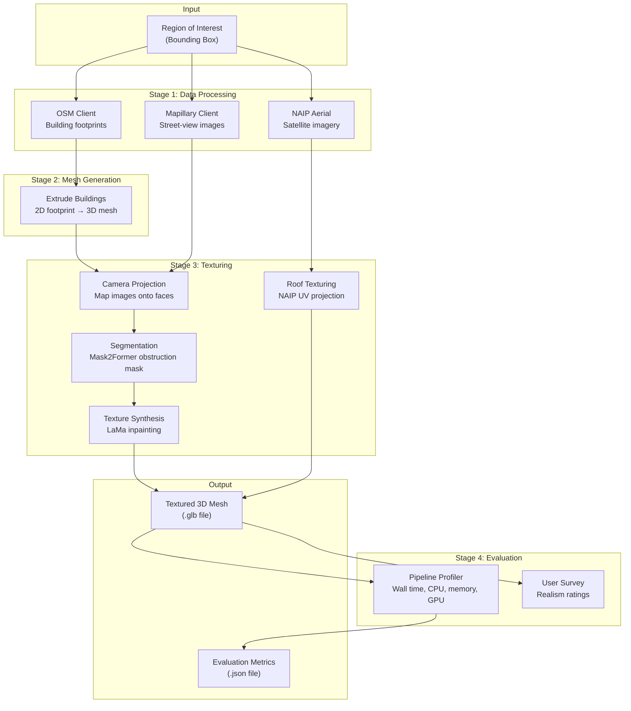

# System Architecture

POSM is organized as a four-stage pipeline orchestrated by a `PipelineChain` framework. Each stage receives the output of the previous stage and passes its result forward, with shared state accessible through `PipelineState`.

## Pipeline Overview



## Technology Stack

| Layer | Technology | Role | Constraints |
|---|---|---|---|
| **Data** | OpenStreetMap, Mapillary, NAIP (USGS) | Building footprints, street-view photos, aerial imagery | OSM geometries are simplified; Mapillary coverage is sporadic |
| **Segmentation** | Mask2Former (`facebook/mask2former-swin-large-cityscapes-semantic`) | Identify and mask obstructions (cars, poles, trees) in street-view images | ~2 min on CPU for 70 images; ~0.6s/image on GPU |
| **Inpainting** | LaMa (Simple LaMa) | Fill masked obstruction regions with plausible building texture | Max input dimension 1024px |
| **Mesh** | Trimesh | Extrude 2D footprints to 3D, combine meshes, export GLB | Heights from OSM are often missing or inaccurate |
| **Vision** | OpenCV, Pillow, SciPy | Camera projection, homography warping, atlas packing | -- |
| **Coordinates** | PyProj, UTM converters | WGS84 ↔ UTM transformations for meter-scale geometry | -- |
| **Profiling** | Custom `PipelineProfiler` | Per-stage wall time, CPU time, peak memory, GPU VRAM delta | Requires `torch` for GPU metrics |

## Pipeline Framework

The pipeline is built on two core abstractions in `common/pipeline_chain.py`:

**`PipelineChain`** defines an ordered sequence of stages. Each stage is a callable `(value, state) -> value` that transforms data and can read/write shared metadata.

**`PipelineState`** carries the running context through the pipeline, including the current value, outputs of all completed stages, and a metadata dictionary for cross-stage communication (e.g., the bounding box, provider data, progress monitor).

```python
# How the pipeline is wired in main.py
run_pipeline = PipelineChain()
run_pipeline.add_stage("fetch",      ingest_data)
run_pipeline.add_stage("build_mesh", build_mesh)
run_pipeline.add_stage("texturing",  tex_projection)
run_pipeline.add_stage("export",     export_mesh)
```

The framework also supports **forking** (parallel branches that merge), **resumption** from a named stage, and optional **profiling** that wraps each stage with timing and memory instrumentation.

## Coordinate Systems

The pipeline operates across multiple coordinate systems:

- **WGS84 (lat/lon)** -- input bounding box and OSM/Mapillary data
- **UTM (meters)** -- all mesh geometry is computed in UTM for metric accuracy
- **Mesh-local** -- final export centers the mesh at origin and flips the Z-axis (`mesh_z = -height`; roofs sit at z=0, buildings extrude downward)

Coordinate conversions are handled by `common/conversions/` and `common/MeshUtils.py`, using `pyproj.Transformer` for WGS84 ↔ UTM.

## Key Design Decisions

**Open data only.** The pipeline exclusively uses open-source and public-domain data sources (OSM, Mapillary, NAIP). No proprietary APIs or paywalled datasets.

**Modular stages.** Each pipeline stage is a standalone function that can be tested, profiled, and replaced independently. The `PipelineChain` framework decouples orchestration from computation.

**Obstruction removal is optional.** The `--no-seg` flag skips Mask2Former + LaMa, trading texture quality for speed. This lets users choose the right tradeoff for their hardware and use case.

**Atlas-based texturing.** Street-view textures are packed into a single texture atlas per mesh, keeping the `.glb` output self-contained and compatible with standard 3D viewers.
