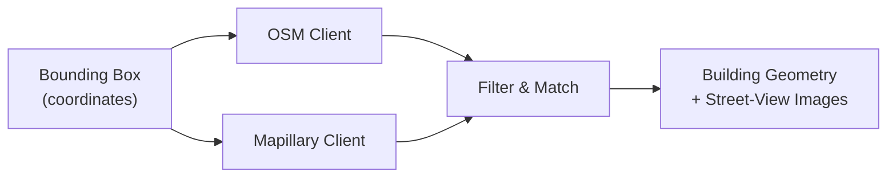

# Stage 1: Data Processing

The data processing stage retrieves all raw geospatial and image data needed by downstream stages. It queries two primary sources given a bounding box and outputs building geometry plus street-view imagery.

## Overview

## Data Sources

### OpenStreetMap (OSM)

OSM provides building footprints as polygons with optional metadata tags. The pipeline fetches all elements tagged as `building` within the bounding box via the Overpass API.

Each building element includes:

- **Geometry** -- a list of lat/lon vertices defining the footprint polygon
- **Building ID** -- unique OSM way/relation ID
- **Height** -- `building:levels` or explicit height tag (often missing)
- **Roof levels** -- `roof:levels` tag (optional)

!!! warning "OSM Data Limitations"
    OSM building heights are community-contributed and frequently missing or inaccurate. When no height data is available, the mesh generator falls back to a default estimate based on building levels (approximately 3m per level).

### Mapillary

Mapillary provides crowdsourced street-level imagery with camera metadata. The pipeline fetches images within the bounding box along with:

- `thumb_original_url` -- full-resolution image URL
- `computed_geometry` -- camera GPS position
- `computed_compass_angle` -- camera heading
- `computed_rotation` -- full rotation vector
- `camera_parameters` -- focal length and lens model
- `width`, `height` -- original image dimensions

### NAIP Aerial Imagery

For roof texturing, the pipeline uses National Agriculture Imagery Program (NAIP) satellite data from the USGS, accessed via the Microsoft Planetary Computer STAC API. NAIP provides public-domain, high-resolution (60cm/pixel) aerial imagery of the continental United States.

## Filtering

Not all Mapillary images are useful. The pipeline applies two filtering passes:

### Metadata Filtering

Images are matched to OSM building footprints using camera position and compass angle. Images that don't face any building in the region are rejected.

### Segmentation Filtering

A **Mask2Former** model (`facebook/mask2former-swin-large-cityscapes-semantic`) segments each image into semantic classes (buildings, sky, road, vegetation, etc.). An image is **accepted** if building pixels cover between **10% and 93%** of the total image area:

- Below 10% -- too little building content (e.g., mostly road or sky)
- Above 93% -- likely an interior shot or camera pressed against a wall

### Post-Filtering

After filtering, images are:

1. **Assigned to OSM building footprints** based on camera geometry
2. **Ranked per building** so the best view is used first during texturing
3. **Paired with segmentation masks** that identify obstruction classes (cars, poles, traffic lights, trees) for later inpainting

## Satellite Data Processing

For roof textures, the pipeline:

1. Downloads NAIP tiles covering the bounding box
2. Fetches OSM building footprints via `osmnx`
3. Aligns OSM outlines to actual roof edges using **OpenCV phase correlation** (corrects ~5m east / 1.4m north pixel offset typical between OSM and NAIP)
4. Crops individual per-building roof images as PNGs
5. Generates an inpainted ground plane texture (roads, grass, trees) by masking out buildings in the satellite image

## Runtime

| Component | Hardware | Time |
|---|---|---|
| OSM + Mapillary fetch | Any (network-bound) | ~7s |
| Mask2Former segmentation (70 images) | Apple M-series CPU | ~2 min |
| Mask2Former segmentation (70 images) | NVIDIA Jetson Orin | ~43s |
| SAM2 per-image inference | Apple M-series CPU | ~216s |
| SAM2 per-image inference | NVIDIA Jetson Orin | ~0.6s |

## Source Code

The data processing stage is implemented in:

- `src/data_ingest/ingest.py` -- orchestrates OSM + Mapillary fetching
- `src/common/providers/osm.py` -- OSM/Overpass API client
- `src/common/providers/mapillary.py` -- Mapillary API client
- `src/segmentation/obstruction.py` -- Mask2Former segmentation and LaMa inpainting
