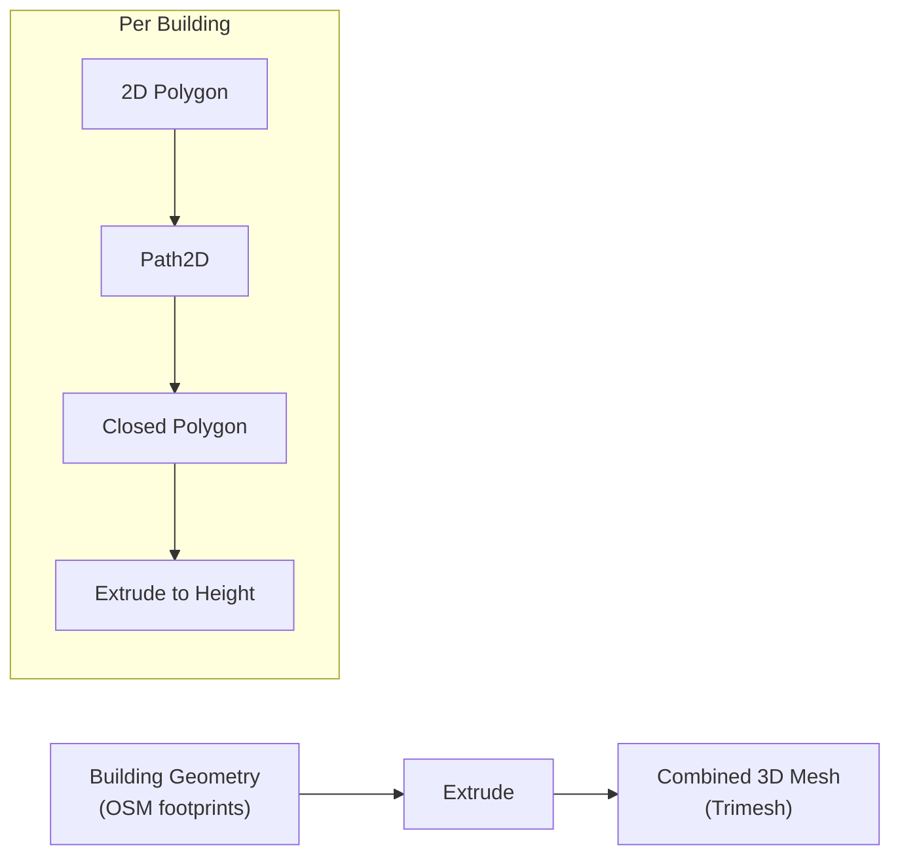

# Stage 2: Mesh Generation

The mesh generation stage converts 2D building footprints from OSM into 3D meshes by extruding each polygon to its estimated height.

## Overview

## How Extrusion Works

For each building element from OSM:

1. **Extract corners** -- convert lat/lon vertices to UTM meter coordinates relative to the bounding box
2. **Build a Path2D** -- create a Trimesh `Path2D` object from the polygon edges
3. **Determine height** -- read the building height from OSM tags (`height`, `building:levels`), falling back to defaults if missing
4. **Extrude** -- call `path.extrude(height)` to create a 3D mesh with walls, roof, and floor

All individual building meshes are then concatenated into a single combined mesh using `trimesh.util.concatenate`.

### Coordinate Convention

The mesh uses a specific Z-axis convention:

- **Roofs sit at z = 0** (the ground plane in satellite imagery coordinates)
- **Buildings extrude downward** with `height = -1 * height`
- This convention aligns roofs with the satellite texture projection from above

!!! note "Why Negative Extrusion?"

    The negative Z extrusion ensures that when satellite roof textures are projected from above, the roof faces are at z=0 and align with the aerial imagery coordinate system. The final export step flips the mesh back to a conventional orientation.

## Height Estimation

Building heights come from OSM tags in priority order:

1. `height` tag (explicit meters)
2. `building:levels` × 3.0 meters per level
3. Default fallback if no data is available

!!! warning "Missing Heights"

    Many OSM buildings lack height data entirely. This produces flat buildings (near-zero height) or default-height boxes that don't match reality. Improving height estimation is an active area of work.

## Current Performance

| Metric             | Value                                |
| ------------------ | ------------------------------------ |
| Runtime            | < 1 second for typical regions       |
| Building alignment | Accurate (matches satellite imagery) |

## Strengths and Limitations

**Strengths:**

- Very fast (sub-second for hundreds of buildings)
- Building footprints align accurately with satellite imagery
- Simple, deterministic process with no ML dependencies

**Limitations:**

- Simplified box geometry (no architectural detail, no roof shapes)
- Heights are frequently inaccurate or missing from OSM
- No support for complex building shapes (courtyards, L-shapes handled by Path2D, but without detail)

## Extension: Point Cloud Approach

An alternative mesh generation approach under exploration uses **Structure from Motion (SfM)** to build point clouds from multiple Mapillary images, then converts them to meshes. This produces more geometrically accurate buildings but requires GPU hardware and significantly more images.

**VGGT** (Visual Geometry Grounded Transformer) is also being evaluated. It predicts camera poses and 3D structure directly from images with fewer views than traditional SfM (~6 images vs. hundreds), producing a colored point cloud of each building face in about 0.5 seconds on GPU.

## Source Code

- `src/mesh_builder/extrude.py` -- `extrude_buildings()` and `build_mesh()` functions
- `src/common/MeshUtils.py` -- `get_corners()`, `get_lines()`, `get_height()` helpers
