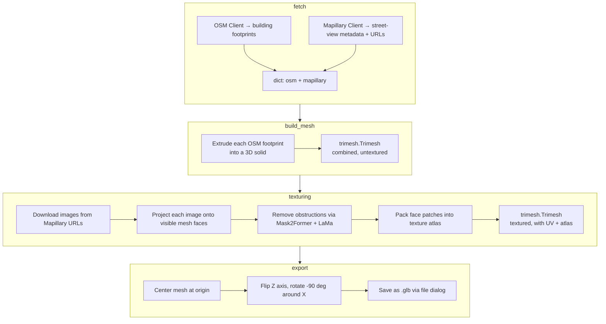

# Pipeline Overview

The POSM pipeline transforms a geographic bounding box into a photorealistic textured 3D mesh in four sequential stages. Each stage is a standalone function wired together by the `PipelineChain` framework.

## End-to-End Flow


## Stage Summary

| Stage                  | Input                                  | Output                                                                                 | Key Technologies                                                       |
| ---------------------- | -------------------------------------- | -------------------------------------------------------------------------------------- | ---------------------------------------------------------------------- |
| **1. Data Processing** | Bounding box coordinates               | Building geometry (OSM JSON) + street-view images (Mapillary) + satellite tiles (NAIP) | Overpass API, Mapillary API, NAIP STAC, Mask2Former, phase correlation |
| **2. Mesh Generation** | Building geometry data                 | Combined 3D trimesh (untextured)                                                       | Trimesh path extrusion, UTM coordinate transforms                      |
| **3. Texturing**       | 3D mesh + street-view/satellite images | Textured 3D mesh with atlas-packed UV maps                                             | OpenCV homography, camera projection, LaMa inpainting                  |
| **4. Evaluation**      | Textured mesh + profiler data          | Performance metrics JSON, user survey results                                          | PipelineProfiler (wall time, CPU, memory, GPU VRAM)                    |

## Pipeline Wiring

The stages are registered in `src/main.py`:

```python
from common import PipelineChain

run_pipeline = PipelineChain()
run_pipeline.add_stage("fetch", ingest_data)
run_pipeline.add_stage("build_mesh", build_mesh)
run_pipeline.add_stage("texturing", tex_projection)
run_pipeline.add_stage("export", export_mesh)
```

Each stage function has the signature `(value, state: PipelineState) -> value`, where `value` is the output of the previous stage and `state` provides access to shared metadata like the bounding box and progress monitor.

## Data Flow Between Stages



## Running Modes

The pipeline supports two optional flags that affect behavior:

- **`--profile <filename>`** — wraps each stage with `PipelineProfiler`, writing per-stage timing and resource usage to a JSON file.
- **`--no-seg`** — skips the Mask2Former + LaMa obstruction-removal pass in the texturing stage, producing faster but noisier textures.

## Success Criteria

| Metric             | Target                                                        |
| ------------------ | ------------------------------------------------------------- |
| Mesh generation    | Uncorrupted `.glb` file                                       |
| Texture generation | Textures derived from street-view images                      |
| Mesh quality       | Average user survey rating ≥ 8/10 on building shape realism   |
| Texture quality    | Average user survey rating ≥ 8/10 on building texture realism |
| Total runtime      | Less than 25 minutes per 247 acres                            |
| Usability          | Average user rating ≥ 7/10 on pipeline ease of use            |
