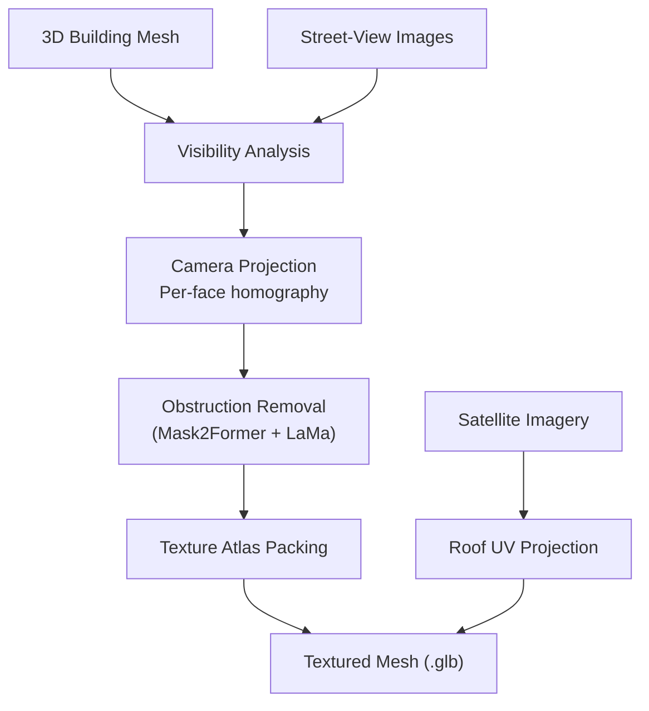

# Stage 3: Texturing

The texturing stage maps real-world imagery onto the 3D building mesh, producing photorealistic facades and rooftops. It combines street-view camera projection for building walls with satellite UV projection for roofs.

## Overview



## Street-View Texturing Pipeline

The street-view texturing process runs in three steps for each image:

### Step 1: Camera Projection

Each Mapillary image has associated camera metadata (GPS position, rotation, focal length). The pipeline reconstructs the camera's **intrinsic matrix K** and **rotation matrix R**, then projects each mesh face's 3D vertices into the image's 2D pixel coordinates.

```
K = [[focal_px,  0,       w/2],
     [0,         focal_px, h/2],
     [0,         0,        1  ]]
```

The camera position is converted from WGS84 to UTM coordinates and placed at a default height of 1.6m (typical dashcam height).

### Step 2: Visibility & Face Assignment

For each mesh face, the pipeline checks:

1. **Frontality** -- is the face's normal pointing toward the camera? (back-faces are skipped)
2. **Projection bounds** -- do all three projected vertices fall within the image dimensions?
3. **Depth** -- are all vertices in front of the camera? (positive Z in camera space)
4. **Occlusion** -- does a ray from the camera to the face center hit another mesh face first?

Each face is assigned to the camera that sees it with the **highest frontality score** (most head-on view), ensuring the best texture quality.

### Step 3: Texture Synthesis

For each assigned face:

1. A **local 2D coordinate frame** is constructed on the face (using edge vectors and the face normal)
2. A **homography matrix** maps from the face's local coordinates to image pixels
3. `cv2.warpPerspective` extracts a rectangular **texture patch** from the image
4. If obstruction removal is enabled, the image was pre-processed with Mask2Former + LaMa to inpaint over cars, trees, poles, and traffic lights

## Obstruction Removal

When enabled (default), each downloaded street-view image passes through:

1. **Mask2Former** (`facebook/mask2former-swin-large-cityscapes-semantic`) segments the image into semantic classes
2. **Obstruction classes** (cars, buses, trucks, motorcycles, poles, traffic lights -- class IDs 5, 6, 7, 8, 11, 12) are combined into a binary mask
3. The mask is **dilated** by 15px to ensure full coverage
4. **LaMa inpainting** fills the masked regions with plausible building texture, synthesizing what the wall likely looks like behind the obstruction

!!! tip "Disabling Obstruction Removal"
    Use `--no-seg` when running the pipeline to skip this step. This is useful for faster iteration or when GPU is not available (Mask2Former on CPU is slow).

## Texture Atlas

All texture patches are packed into a single **texture atlas** (4096px wide, variable height). Faces without an assigned camera receive a neutral gray fallback color from a small strip at the bottom of the atlas.

The atlas uses a simple left-to-right, top-to-bottom bin-packing algorithm:

```
┌──────────────────────────────────┐
│ patch_0 │ patch_1 │ patch_2 │    │  ← row 0
├─────────┼─────────┼─────────┤    │
│ patch_3 │ patch_4 │              │  ← row 1
├─────────┼─────────┼──────────────┤
│              ...                 │
├──────────────────────────────────┤
│ ░░░░░░░░ gray fallback ░░░░░░░░ │  ← 16px strip
└──────────────────────────────────┘
```

Each face's UV coordinates index into its corresponding patch within the atlas. The atlas is embedded as a `PBRMaterial` base color texture in the final mesh.

## Roof Texturing

Roof textures come from NAIP satellite imagery (processed in Stage 1):

1. Each cropped roof image is mapped onto the **top face** of its building mesh using UV projection from directly above
2. The ground plane (roads, grass, trees) is created by **inpainting** over building footprint areas in the satellite image
3. The ground texture is placed on a flat plane beneath all buildings
4. Everything is exported as a single `.glb` file

## Runtime

Texturing is the most compute-intensive stage, accounting for roughly **93%** of total pipeline wall time:

| Component | Wall Time | CPU % |
|---|---|---|
| Image download + segmentation | ~150s | varies |
| Visibility analysis + projection | ~230s | 76% |
| Atlas construction | <1s | -- |
| **Total texturing stage** | **~6m 18s** | **76%** |

Peak memory during texturing is approximately **12.4 GB RAM** and **1.06 GB GPU VRAM** (when using GPU for segmentation).

## Source Code

- `src/texturing/tex_projection.py` -- `apply_textures()`, camera math, atlas packing
- `src/segmentation/obstruction.py` -- `remove_obstructions()`, Mask2Former + LaMa
